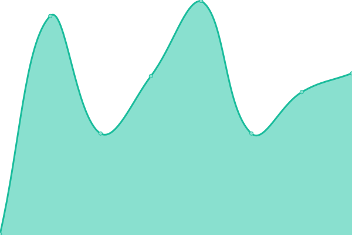
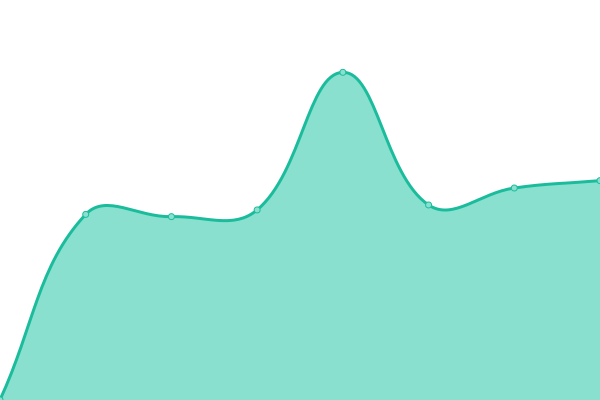
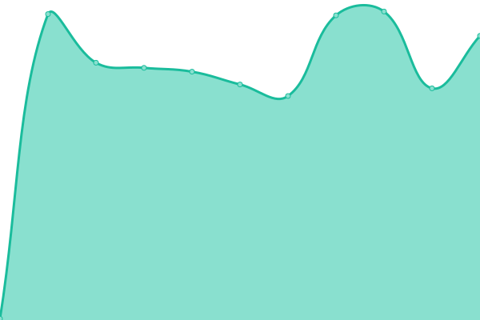
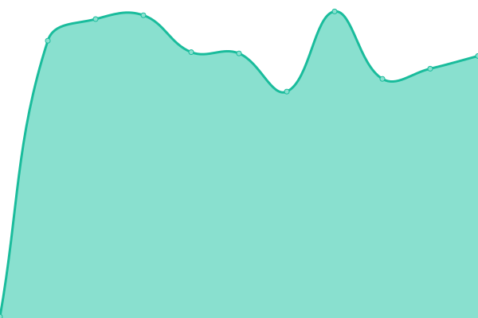
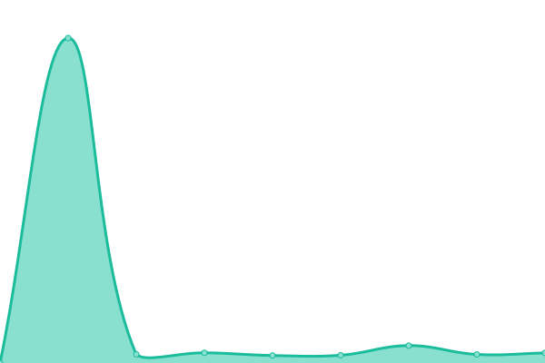
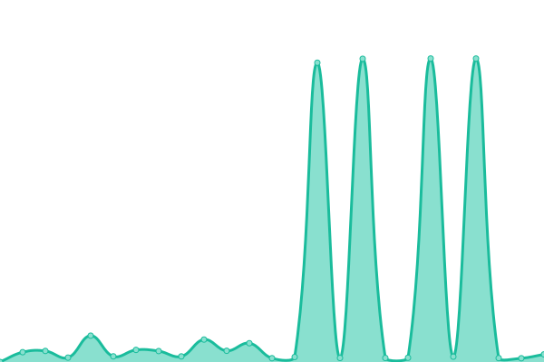
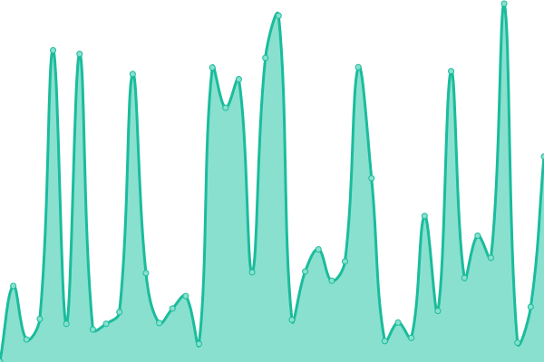

# [📈 Live Status](https://kodadot.github.io/uptime/): <!--live status--> **🟩 All systems operational**

This repository contains the open-source uptime monitor and status page for [Kodadot](https://kodadot.github.io/uptime/). We use [Issues](https://github.com/kodadot/uptime/issues) as incident reports, [Actions](https://github.com/kodadot/uptime/actions) as uptime monitors, and [Pages](https://kodadot.github.io/uptime/) for the status page.

<!--start: status pages-->
<!-- This summary is generated by Upptime (https://github.com/upptime/upptime) -->
<!-- Do not edit this manually, your changes will be overwritten -->
<!-- prettier-ignore -->
| URL | Status | History | Response Time | Uptime |
| --- | ------ | ------- | ------------- | ------ |
|  [durable-jpeg](https://durable-jpeg.kodadot.workers.dev/batch) | 🟩 Up | [durable-jpeg.yml](https://github.com/kodadot/uptime/commits/HEAD/history/durable-jpeg.yml) | 

 397ms
     
 | 

<a href="https://kodadot.js.org/history/durable-jpeg">100.00%</a>
    

|  [direct-upload](https://direct-upload.kodadot.workers.dev/) | 🟩 Up | [direct-upload.yml](https://github.com/kodadot/uptime/commits/HEAD/history/direct-upload.yml) | 

 89ms
     
 | 

<a href="https://kodadot.js.org/history/direct-upload">100.00%</a>
    

|  [estuary](https://pinning.kodadot.workers.dev/) | 🟩 Up | [estuary.yml](https://github.com/kodadot/uptime/commits/HEAD/history/estuary.yml) | 

 85ms
     
 | 

<a href="https://kodadot.js.org/history/estuary">100.00%</a>
    

|  [nft-storage](https://nft-storage.kodadot.workers.dev/) | 🟩 Up | [nft-storage.yml](https://github.com/kodadot/uptime/commits/HEAD/history/nft-storage.yml) | 

 92ms
     
 | 

<a href="https://kodadot.js.org/history/nft-storage">100.00%</a>
    

|  [antick](https://squid.subsquid.io/antick/v/001-rc0/graphql) | 🟩 Up | [antick.yml](https://github.com/kodadot/uptime/commits/HEAD/history/antick.yml) | 

 241ms
     
 | 

<a href="https://kodadot.js.org/history/antick">100.00%</a>
    

|  [snekk](https://squid.subsquid.io/snekk/v/004/graphql) | 🟩 Up | [snekk.yml](https://github.com/kodadot/uptime/commits/HEAD/history/snekk.yml) | 

 154ms
     
 | 

<a href="https://kodadot.js.org/history/snekk">100.00%</a>
    

|  [bsx](https://squid.subsquid.io/snekk/v/005/graphql) | 🟩 Up | [bsx.yml](https://github.com/kodadot/uptime/commits/HEAD/history/bsx.yml) | 

 156ms
     
 | 

<a href="https://kodadot.js.org/history/bsx">100.00%</a>
    

|  [rubick](https://squid.subsquid.io/rubick/graphql) | 🟩 Up | [rubick.yml](https://github.com/kodadot/uptime/commits/HEAD/history/rubick.yml) | 

 154ms
     
 | 

<a href="https://kodadot.js.org/history/rubick">100.00%</a>
    

|  [click](https://squid.subsquid.io/click/v/002/graphql) | 🟩 Up | [click.yml](https://github.com/kodadot/uptime/commits/HEAD/history/click.yml) | 

 155ms
     
 | 

<a href="https://kodadot.js.org/history/click">100.00%</a>
    

|  [rubick - curated list](https://squid.subsquid.io/rubick/graphql) | 🟩 Up | [rubick-curated-list.yml](https://github.com/kodadot/uptime/commits/HEAD/history/rubick-curated-list.yml) | 

 159ms
     
 | 

<a href="https://kodadot.js.org/history/rubick-curated-list">100.00%</a>
    

|  [rubick - newest list](https://squid.subsquid.io/rubick/graphql) | 🟩 Up | [rubick-newest-list.yml](https://github.com/kodadot/uptime/commits/HEAD/history/rubick-newest-list.yml) | 

 1250ms
     
 | 

<a href="https://kodadot.js.org/history/rubick-newest-list">100.00%</a>
    

|  [rubick - latest sales](https://squid.subsquid.io/rubick/graphql) | 🟩 Up | [rubick-latest-sales.yml](https://github.com/kodadot/uptime/commits/HEAD/history/rubick-latest-sales.yml) | 

 589ms
     
 | 

<a href="https://kodadot.js.org/history/rubick-latest-sales">100.00%</a>
    

|  [rubick - spotlight](https://squid.subsquid.io/rubick/graphql) | 🟩 Up | [rubick-spotlight.yml](https://github.com/kodadot/uptime/commits/HEAD/history/rubick-spotlight.yml) | 

 495ms
     
 | 

<a href="https://kodadot.js.org/history/rubick-spotlight">100.00%</a>
    

|  [rubick - series-insight](https://squid.subsquid.io/rubick/graphql) | 🟩 Up | [rubick-series-insight.yml](https://github.com/kodadot/uptime/commits/HEAD/history/rubick-series-insight.yml) | 

 214ms
     
 | 

<a href="https://kodadot.js.org/history/rubick-series-insight">100.00%</a>
    

|  [rubick - sales](https://squid.subsquid.io/rubick/graphql) | 🟩 Up | [rubick-sales.yml](https://github.com/kodadot/uptime/commits/HEAD/history/rubick-sales.yml) | 

 240ms
     
 | 

<a href="https://kodadot.js.org/history/rubick-sales">100.00%</a>
    

|  [rubick - hot](https://squid.subsquid.io/rubick/graphql) | 🟩 Up | [rubick-hot.yml](https://github.com/kodadot/uptime/commits/HEAD/history/rubick-hot.yml) | 

 304ms
     
 | 

<a href="https://kodadot.js.org/history/rubick-hot">100.00%</a>
    

|  [Netlify functions](https://beta.kodadot.xyz/.netlify/functions/) | 🟩 Up | [netlify-functions.yml](https://github.com/kodadot/uptime/commits/HEAD/history/netlify-functions.yml) | 

 150ms
     
 | 

<a href="https://kodadot.js.org/history/netlify-functions">100.00%</a>
    

|  [Seo Card](https://og-image-green-seven.vercel.app/) | 🟩 Up | [seo-card.yml](https://github.com/kodadot/uptime/commits/HEAD/history/seo-card.yml) | 

 132ms
     
 | 

<a href="https://kodadot.js.org/history/seo-card">100.00%</a>
    

|  [Seo Card with Content](https://og-image-green-seven.vercel.app/%20Luna%20Witches%20%233.jpeg?price=0.5500KSM&image=https://image.w.kodadot.xyz/ipfs/bafybeifkgsyqa6h5mniydsz75yzd7qrffq5jh3osgjlafab2pnlsutsyvy&mime=image/jpeg) | 🟩 Up | [seo-card-with-content.yml](https://github.com/kodadot/uptime/commits/HEAD/history/seo-card-with-content.yml) | 

 2957ms
     
 | 

<a href="https://kodadot.js.org/history/seo-card-with-content">99.30%</a>
    

|  [image-gateway](https://image.w.kodadot.xyz/ipfs/bafybeidkhq7aynm2yuuvzimkqcabbqgg3w2uzvy2e7zq3vl5ojhf36kxea) | 🟩 Up | [image-gateway.yml](https://github.com/kodadot/uptime/commits/HEAD/history/image-gateway.yml) | 

 611ms
     
 | 

<a href="https://kodadot.js.org/history/image-gateway">100.00%</a>
    

|  [nftstorage.link](https://bafybeidkhq7aynm2yuuvzimkqcabbqgg3w2uzvy2e7zq3vl5ojhf36kxea.ipfs.nftstorage.link/) | 🟩 Up | [nftstorage-link.yml](https://github.com/kodadot/uptime/commits/HEAD/history/nftstorage-link.yml) | 

 629ms
     
 | 

<a href="https://kodadot.js.org/history/nftstorage-link">99.88%</a>
    

|  [clouflare ipfs](https://cloudflare-ipfs.com/ipfs/bafybeidkhq7aynm2yuuvzimkqcabbqgg3w2uzvy2e7zq3vl5ojhf36kxea) | 🟩 Up | [clouflare-ipfs.yml](https://github.com/kodadot/uptime/commits/HEAD/history/clouflare-ipfs.yml) | 

 246ms
     
 | 

<a href="https://kodadot.js.org/history/clouflare-ipfs">100.00%</a>
    

|  [dweb-link](https://dweb.link/ipfs/bafybeidkhq7aynm2yuuvzimkqcabbqgg3w2uzvy2e7zq3vl5ojhf36kxea) | 🟩 Up | [dweb-link.yml](https://github.com/kodadot/uptime/commits/HEAD/history/dweb-link.yml) | 

 650ms
     
 | 

<a href="https://kodadot.js.org/history/dweb-link">98.94%</a>
    

|  [coingecko](https://api.coingecko.com/api/v3/ping) | 🟩 Up | [coingecko.yml](https://github.com/kodadot/uptime/commits/HEAD/history/coingecko.yml) | 

 139ms
     
 | 

<a href="https://kodadot.js.org/history/coingecko">100.00%</a>
    

|  [ramp](https://ramp.network/buy/) | 🟩 Up | [ramp.yml](https://github.com/kodadot/uptime/commits/HEAD/history/ramp.yml) | 

 169ms
     
 | 

<a href="https://kodadot.js.org/history/ramp">100.00%</a>
    

|  [KodaDot - home](https://kodadot.xyz/) | 🟩 Up | [koda-dot-home.yml](https://github.com/kodadot/uptime/commits/HEAD/history/koda-dot-home.yml) | 

 117ms
     
 | 

<a href="https://kodadot.js.org/history/koda-dot-home">100.00%</a>
    

<!--end: status pages-->

[**Visit our status website →**](https://kodadot.github.io/uptime/)

## 📄 License

- Powered by: [Upptime](https://github.com/upptime/upptime)
- Code: [MIT](./LICENSE) © [KodaDot](https://kodadot.github.io/uptime/)
- Data in the `./history` directory: [Open Database License](https://opendatacommons.org/licenses/odbl/1-0/)
