# [📈 Live Status](https://kodadot.github.io/uptime/): <!--live status--> **🟩 All systems operational**

This repository contains the open-source uptime monitor and status page for [Kodadot](https://kodadot.github.io/uptime/). We use [Issues](https://github.com/kodadot/uptime/issues) as incident reports, [Actions](https://github.com/kodadot/uptime/actions) as uptime monitors, and [Pages](https://kodadot.github.io/uptime/) for the status page.

<!--start: status pages-->
<!-- This summary is generated by Upptime (https://github.com/upptime/upptime) -->
<!-- Do not edit this manually, your changes will be overwritten -->
<!-- prettier-ignore -->
| URL | Status | History | Response Time | Uptime |
| --- | ------ | ------- | ------------- | ------ |
|  [durable-jpeg](https://durable-jpeg.kodadot.workers.dev/batch) | 🟩 Up | [durable-jpeg.yml](https://github.com/kodadot/uptime/commits/HEAD/history/durable-jpeg.yml) | 

 486ms
     
 | 

<a href="https://uptime.kodadot.xyz/history/durable-jpeg">100.00%</a>
    

|  [direct-upload](https://direct-upload.kodadot.workers.dev/) | 🟩 Up | [direct-upload.yml](https://github.com/kodadot/uptime/commits/HEAD/history/direct-upload.yml) | 

 119ms
     
 | 

<a href="https://uptime.kodadot.xyz/history/direct-upload">100.00%</a>
    

|  [estuary](https://pinning.kodadot.workers.dev/) | 🟩 Up | [estuary.yml](https://github.com/kodadot/uptime/commits/HEAD/history/estuary.yml) | 

 107ms
     
 | 

<a href="https://uptime.kodadot.xyz/history/estuary">100.00%</a>
    

|  [nft-storage](https://ipos.kodadot.workers.dev/) | 🟩 Up | [nft-storage.yml](https://github.com/kodadot/uptime/commits/HEAD/history/nft-storage.yml) | 

 179ms
     
 | 

<a href="https://uptime.kodadot.xyz/history/nft-storage">100.00%</a>
    

|  [mantle](https://squid.subsquid.io/flock/graphql) | 🟩 Up | [mantle.yml](https://github.com/kodadot/uptime/commits/HEAD/history/mantle.yml) | 

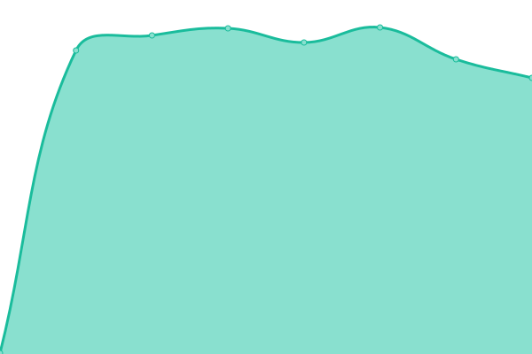 329ms
     
 | 

<a href="https://uptime.kodadot.xyz/history/mantle">100.00%</a>
    

|  [base](https://squid.subsquid.io/basick/graphql) | 🟩 Up | [base.yml](https://github.com/kodadot/uptime/commits/HEAD/history/base.yml) | 

 122ms
     
 | 

<a href="https://uptime.kodadot.xyz/history/base">100.00%</a>
    

|  [stmn](https://squid.subsquid.io/stick/graphql) | 🟩 Up | [stmn.yml](https://github.com/kodadot/uptime/commits/HEAD/history/stmn.yml) | 

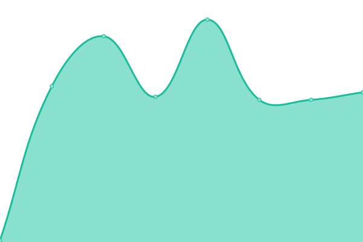 119ms
     
 | 

<a href="https://uptime.kodadot.xyz/history/stmn">100.00%</a>
    

|  [stt](https://squid.subsquid.io/speck/graphql) | 🟩 Up | [stt.yml](https://github.com/kodadot/uptime/commits/HEAD/history/stt.yml) | 

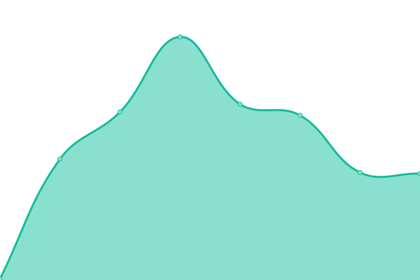 119ms
     
 | 

<a href="https://uptime.kodadot.xyz/history/stt">100.00%</a>
    

|  [stmn - drops](https://squid.subsquid.io/stick/graphql) | 🟩 Up | [stmn-drops.yml](https://github.com/kodadot/uptime/commits/HEAD/history/stmn-drops.yml) | 

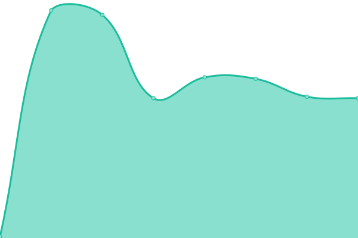 437ms
     
 | 

<a href="https://uptime.kodadot.xyz/history/stmn-drops">100.00%</a>
    

|  [stt - drops](https://squid.subsquid.io/speck/graphql) | 🟩 Up | [stt-drops.yml](https://github.com/kodadot/uptime/commits/HEAD/history/stt-drops.yml) | 

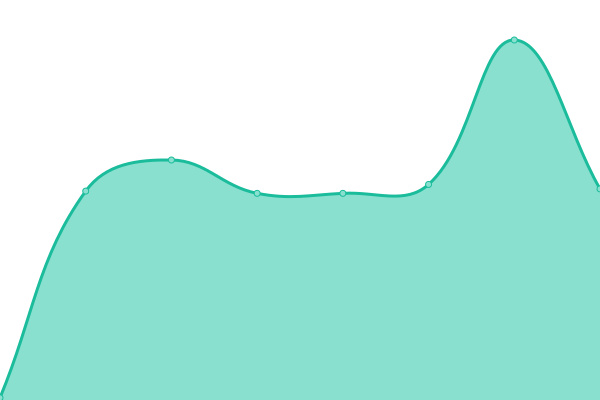 167ms
     
 | 

<a href="https://uptime.kodadot.xyz/history/stt-drops">100.00%</a>
    

|  [Seo Card](https://og-image-green-seven.vercel.app/) | 🟩 Up | [seo-card.yml](https://github.com/kodadot/uptime/commits/HEAD/history/seo-card.yml) | 

 123ms
     
 | 

<a href="https://uptime.kodadot.xyz/history/seo-card">100.00%</a>
    

|  [Seo Card with Content](https://og-image-green-seven.vercel.app/%20Luna%20Witches%20%233.jpeg?price=0.5500KSM&image=https://image.w.kodadot.xyz/ipfs/bafybeifkgsyqa6h5mniydsz75yzd7qrffq5jh3osgjlafab2pnlsutsyvy&mime=image/jpeg) | 🟩 Up | [seo-card-with-content.yml](https://github.com/kodadot/uptime/commits/HEAD/history/seo-card-with-content.yml) | 

 36ms
     
 | 

<a href="https://uptime.kodadot.xyz/history/seo-card-with-content">100.00%</a>
    

|  [price - kusama](https://price.kodadot.workers.dev/price/kusama) | 🟩 Up | [price-kusama.yml](https://github.com/kodadot/uptime/commits/HEAD/history/price-kusama.yml) | 

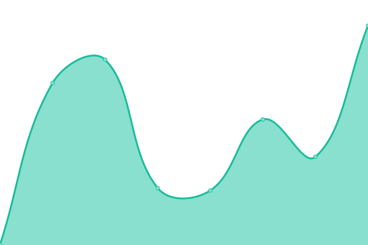 423ms
     
 | 

<a href="https://uptime.kodadot.xyz/history/price-kusama">100.00%</a>
    

|  [price - polkadot](https://price.kodadot.workers.dev/price/polkadot) | 🟩 Up | [price-polkadot.yml](https://github.com/kodadot/uptime/commits/HEAD/history/price-polkadot.yml) | 

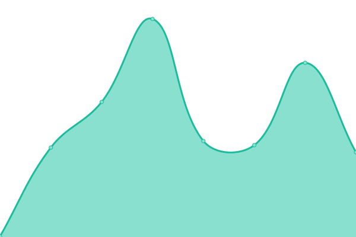 187ms
     
 | 

<a href="https://uptime.kodadot.xyz/history/price-polkadot">100.00%</a>
    

|  [price - basilisk](https://price.kodadot.workers.dev/price/basilisk) | 🟩 Up | [price-basilisk.yml](https://github.com/kodadot/uptime/commits/HEAD/history/price-basilisk.yml) | 

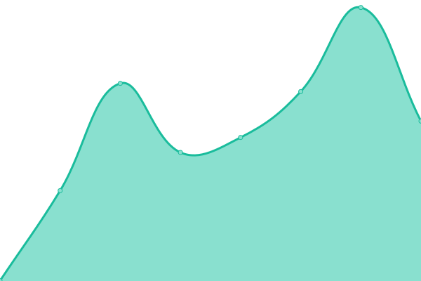 358ms
     
 | 

<a href="https://uptime.kodadot.xyz/history/price-basilisk">100.00%</a>
    

|  [KodaDot - production](https://kodadot.xyz/) | 🟩 Up | [koda-dot-production.yml](https://github.com/kodadot/uptime/commits/HEAD/history/koda-dot-production.yml) | 

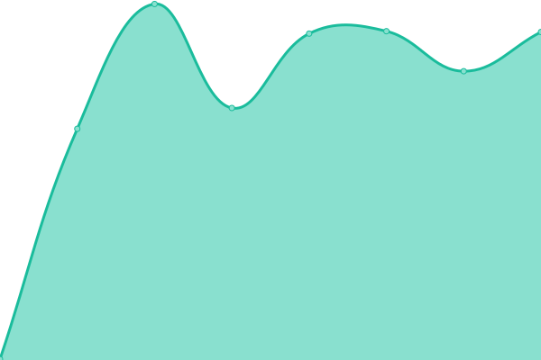 451ms
     
 | 

<a href="https://uptime.kodadot.xyz/history/koda-dot-production">100.00%</a>
    

|  [KodaDot - beta](https://beta.kodadot.xyz/) | 🟩 Up | [koda-dot-beta.yml](https://github.com/kodadot/uptime/commits/HEAD/history/koda-dot-beta.yml) | 

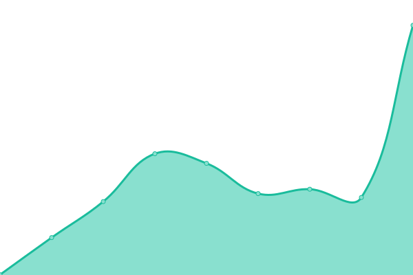 380ms
     
 | 

<a href="https://uptime.kodadot.xyz/history/koda-dot-beta">100.00%</a>
    

|  [KodaDot - canary](https://canary.kodadot.xyz/) | 🟩 Up | [koda-dot-canary.yml](https://github.com/kodadot/uptime/commits/HEAD/history/koda-dot-canary.yml) | 

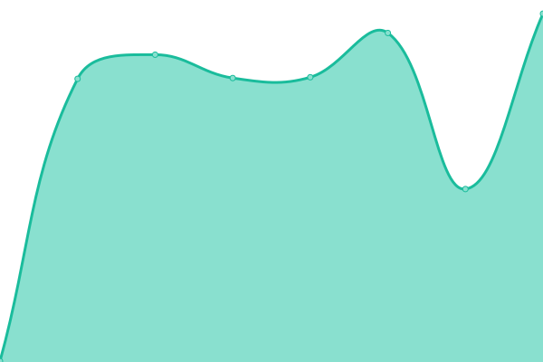 370ms
     
 | 

<a href="https://uptime.kodadot.xyz/history/koda-dot-canary">100.00%</a>
    

<!--end: status pages-->

[**Visit our status website →**](https://kodadot.github.io/uptime/)

## 📄 License

- Powered by: [Upptime](https://github.com/upptime/upptime)
- Code: [MIT](./LICENSE) © [KodaDot](https://kodadot.github.io/uptime/)
- Data in the `./history` directory: [Open Database License](https://opendatacommons.org/licenses/odbl/1-0/)
