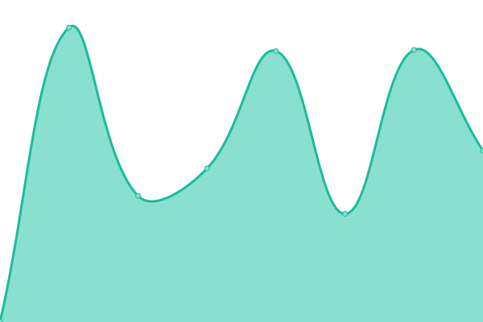
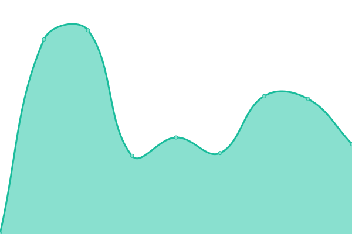
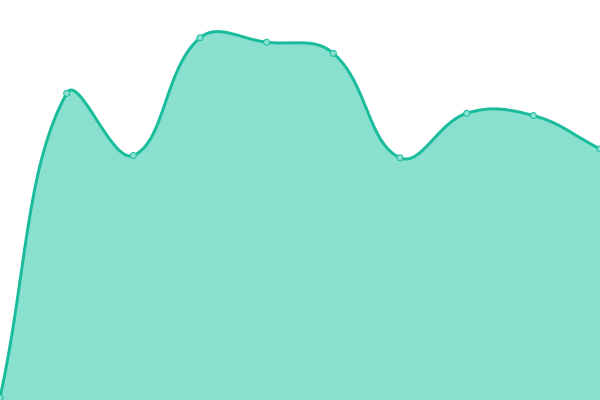
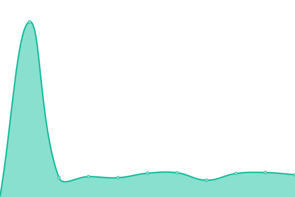

# [📈 Live Status](https://preschian.github.io/kodadot-status/): <!--live status--> **🟩 All systems operational**

This repository contains the open-source uptime monitor and status page for [Kodadot](https://preschian.github.io/kodadot-status/). We use [Issues](https://github.com/preschian/kodadot-status/issues) as incident reports, [Actions](https://github.com/preschian/kodadot-status/actions) as uptime monitors, and [Pages](https://preschian.github.io/kodadot-status/) for the status page.

<!--start: status pages-->
<!-- This summary is generated by Upptime (https://github.com/upptime/upptime) -->
<!-- Do not edit this manually, your changes will be overwritten -->
<!-- prettier-ignore -->
| URL | Status | History | Response Time | Uptime |
| --- | ------ | ------- | ------------- | ------ |
|  [durable-jpeg](https://durable-jpeg.kodadot.workers.dev/batch) | 🟩 Up | [durable-jpeg.yml](https://github.com/preschian/kodadot-status/commits/HEAD/history/durable-jpeg.yml) | 

 253ms
     
 | 

<a href="https://preschian.github.io/kodadot-status/history/durable-jpeg">100.00%</a>
    

|  [direct-upload](https://direct-upload.kodadot.workers.dev/) | 🟩 Up | [direct-upload.yml](https://github.com/preschian/kodadot-status/commits/HEAD/history/direct-upload.yml) | 

 214ms
     
 | 

<a href="https://preschian.github.io/kodadot-status/history/direct-upload">100.00%</a>
    

|  [estuary](https://pinning.kodadot.workers.dev/) | 🟩 Up | [estuary.yml](https://github.com/preschian/kodadot-status/commits/HEAD/history/estuary.yml) | 

 159ms
     
 | 

<a href="https://preschian.github.io/kodadot-status/history/estuary">100.00%</a>
    

|  [nft-storage](https://nft-storage.kodadot.workers.dev/) | 🟩 Up | [nft-storage.yml](https://github.com/preschian/kodadot-status/commits/HEAD/history/nft-storage.yml) | 

 170ms
     
 | 

<a href="https://preschian.github.io/kodadot-status/history/nft-storage">100.00%</a>
    

|  [Subsquid v5](https://app.gc.subsquid.io/beta/rubick/005/graphql) | 🟩 Up | [subsquid-v5.yml](https://github.com/preschian/kodadot-status/commits/HEAD/history/subsquid-v5.yml) | 

 237ms
     
 | 

<a href="https://preschian.github.io/kodadot-status/history/subsquid-v5">100.00%</a>
    

|  [Subsquid v6](https://app.gc.subsquid.io/beta/rubick/006/graphql) | 🟩 Up | [subsquid-v6.yml](https://github.com/preschian/kodadot-status/commits/HEAD/history/subsquid-v6.yml) | 

 123ms
     
 | 

<a href="https://preschian.github.io/kodadot-status/history/subsquid-v6">100.00%</a>
    

|  [snekk](https://app.gc.subsquid.io/beta/snekk/003/graphql) | 🟩 Up | [snekk.yml](https://github.com/preschian/kodadot-status/commits/HEAD/history/snekk.yml) | 

 124ms
     
 | 

<a href="https://preschian.github.io/kodadot-status/history/snekk">100.00%</a>
    

|  [click](https://app.gc.subsquid.io/beta/click/001-rc0/graphql) | 🟩 Up | [click.yml](https://github.com/preschian/kodadot-status/commits/HEAD/history/click.yml) | 

 126ms
     
 | 

<a href="https://preschian.github.io/kodadot-status/history/click">100.00%</a>
    

|  [subsquid - series-insight](https://app.gc.subsquid.io/beta/rubick/006/graphql) | 🟩 Up | [subsquid-series-insight.yml](https://github.com/preschian/kodadot-status/commits/HEAD/history/subsquid-series-insight.yml) | 

 161ms
     
 | 

<a href="https://preschian.github.io/kodadot-status/history/subsquid-series-insight">100.00%</a>
    

|  [subsquid - spotlight](https://app.gc.subsquid.io/beta/rubick/006/graphql) | 🟩 Up | [subsquid-spotlight.yml](https://github.com/preschian/kodadot-status/commits/HEAD/history/subsquid-spotlight.yml) | 

 431ms
     
 | 

<a href="https://preschian.github.io/kodadot-status/history/subsquid-spotlight">100.00%</a>
    

|  [Netlify functions](https://beta.kodadot.xyz/.netlify/functions/) | 🟩 Up | [netlify-functions.yml](https://github.com/preschian/kodadot-status/commits/HEAD/history/netlify-functions.yml) | 

 210ms
     
 | 

<a href="https://preschian.github.io/kodadot-status/history/netlify-functions">100.00%</a>
    

|  [Seo Card](https://og-image-green-seven.vercel.app/) | 🟩 Up | [seo-card.yml](https://github.com/preschian/kodadot-status/commits/HEAD/history/seo-card.yml) | 

 115ms
     
 | 

<a href="https://preschian.github.io/kodadot-status/history/seo-card">100.00%</a>
    

|  [Seo Card with Content](https://og-image-green-seven.vercel.app/Kusama%20Bot%20120.jpeg?price=&image=https://kodadot.mypinata.cloud/ipfs/bafkreiefbdznbjx7ixsdvezdtupj7xpdmgigm7uygl26mk2bozwolemodi&mime=image/jpeg) | 🟩 Up | [seo-card-with-content.yml](https://github.com/preschian/kodadot-status/commits/HEAD/history/seo-card-with-content.yml) | 

 335ms
     
 | 

<a href="https://preschian.github.io/kodadot-status/history/seo-card-with-content">96.75%</a>
    

|  [magick - nFTStatsByIssuer](https://api.subquery.network/sq/vikiival/magick) | 🟩 Up | [magick-n-ft-stats-by-issuer.yml](https://github.com/preschian/kodadot-status/commits/HEAD/history/magick-n-ft-stats-by-issuer.yml) | 

 787ms
     
 | 

<a href="https://preschian.github.io/kodadot-status/history/magick-n-ft-stats-by-issuer">100.00%</a>
    

|  [magick - gallery](https://api.subquery.network/sq/vikiival/magick) | 🟩 Up | [magick-gallery.yml](https://github.com/preschian/kodadot-status/commits/HEAD/history/magick-gallery.yml) | 

 166ms
     
 | 

<a href="https://preschian.github.io/kodadot-status/history/magick-gallery">100.00%</a>
    

|  [magick - collection](https://api.subquery.network/sq/vikiival/magick) | 🟩 Up | [magick-collection.yml](https://github.com/preschian/kodadot-status/commits/HEAD/history/magick-collection.yml) | 

 155ms
     
 | 

<a href="https://preschian.github.io/kodadot-status/history/magick-collection">100.00%</a>
    

|  [magick - nftById](https://api.subquery.network/sq/vikiival/magick) | 🟩 Up | [magick-nft-by-id.yml](https://github.com/preschian/kodadot-status/commits/HEAD/history/magick-nft-by-id.yml) | 

 157ms
     
 | 

<a href="https://preschian.github.io/kodadot-status/history/magick-nft-by-id">100.00%</a>
    

|  [magick - collectionById](https://api.subquery.network/sq/vikiival/magick) | 🟩 Up | [magick-collection-by-id.yml](https://github.com/preschian/kodadot-status/commits/HEAD/history/magick-collection-by-id.yml) | 

 161ms
     
 | 

<a href="https://preschian.github.io/kodadot-status/history/magick-collection-by-id">100.00%</a>
    

|  [magick - collectionListByAccount](https://api.subquery.network/sq/vikiival/magick) | 🟩 Up | [magick-collection-list-by-account.yml](https://github.com/preschian/kodadot-status/commits/HEAD/history/magick-collection-list-by-account.yml) | 

 158ms
     
 | 

<a href="https://preschian.github.io/kodadot-status/history/magick-collection-list-by-account">100.00%</a>
    

|  [magick - firstNftByIssuer](https://api.subquery.network/sq/vikiival/magick) | 🟩 Up | [magick-first-nft-by-issuer.yml](https://github.com/preschian/kodadot-status/commits/HEAD/history/magick-first-nft-by-issuer.yml) | 

 203ms
     
 | 

<a href="https://preschian.github.io/kodadot-status/history/magick-first-nft-by-issuer">100.00%</a>
    

|  [magick - firstNftByIssuer](https://api.subquery.network/sq/vikiival/magick) | 🟩 Up | [magick-first-nft-by-issuer.yml](https://github.com/preschian/kodadot-status/commits/HEAD/history/magick-first-nft-by-issuer.yml) | 

 203ms
     
 | 

<a href="https://preschian.github.io/kodadot-status/history/magick-first-nft-by-issuer">100.00%</a>
    

|  [pinata](https://kodadot.mypinata.cloud/ipfs/bafkreigrljewlnnusfefnmm75rrmb46ecn2cv27dfkewzqrom6zcqetefq) | 🟩 Up | [pinata.yml](https://github.com/preschian/kodadot-status/commits/HEAD/history/pinata.yml) | 

 1576ms
     
 | 

<a href="https://preschian.github.io/kodadot-status/history/pinata">100.00%</a>
    

|  [coingecko](https://api.coingecko.com/api/v3/ping) | 🟩 Up | [coingecko.yml](https://github.com/preschian/kodadot-status/commits/HEAD/history/coingecko.yml) | 

 124ms
     
 | 

<a href="https://preschian.github.io/kodadot-status/history/coingecko">98.99%</a>
    

|  [ramp](https://ramp.network/buy/) | 🟩 Up | [ramp.yml](https://github.com/preschian/kodadot-status/commits/HEAD/history/ramp.yml) | 

 110ms
     
 | 

<a href="https://preschian.github.io/kodadot-status/history/ramp">100.00%</a>
    

|  [clouflare ipfs](https://cloudflare-ipfs.com/ipfs/QmXoypizjW3WknFiJnKLwHCnL72vedxjQkDDP1mXWo6uco/wiki/) | 🟩 Up | [clouflare-ipfs.yml](https://github.com/preschian/kodadot-status/commits/HEAD/history/clouflare-ipfs.yml) | 

 131ms
     
 | 

<a href="https://preschian.github.io/kodadot-status/history/clouflare-ipfs">100.00%</a>
    

|  [KodaDot - home](https://kodadot.xyz/) | 🟩 Up | [koda-dot-home.yml](https://github.com/preschian/kodadot-status/commits/HEAD/history/koda-dot-home.yml) | 

 230ms
     
 | 

<a href="https://preschian.github.io/kodadot-status/history/koda-dot-home">100.00%</a>
    

<!--end: status pages-->

[**Visit our status website →**](https://preschian.github.io/kodadot-status/)

## 📄 License

- Powered by: [Upptime](https://github.com/upptime/upptime)
- Code: [MIT](./LICENSE) © [Preschian Febryantara](https://preschian.github.io/kodadot-status/)
- Data in the `./history` directory: [Open Database License](https://opendatacommons.org/licenses/odbl/1-0/)
