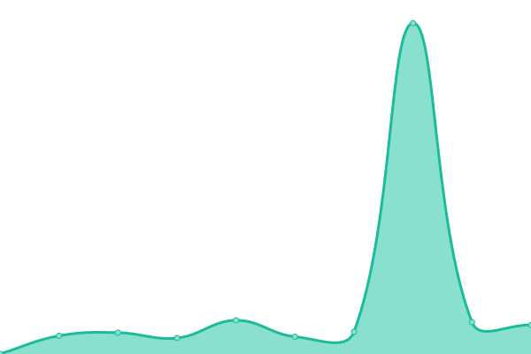
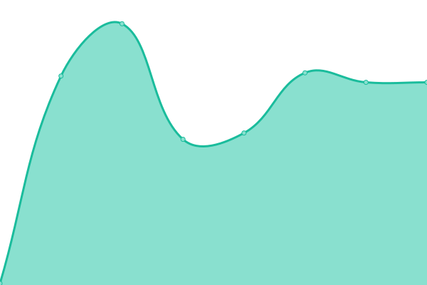
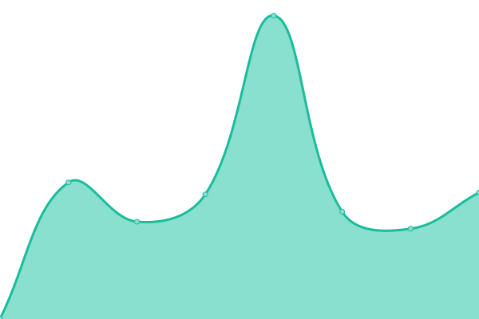
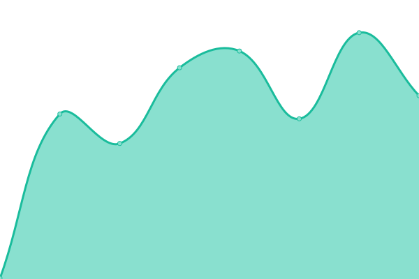
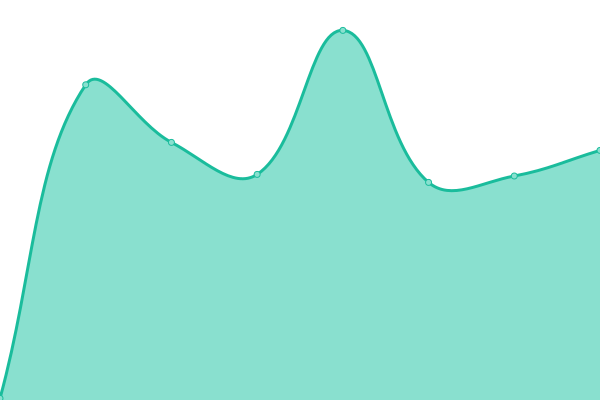
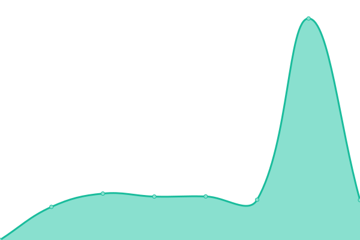
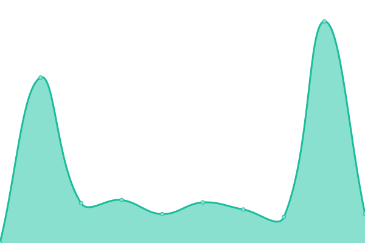

# [📈 Live Status](https://preschian.github.io/kodadot-status/): <!--live status--> **🟩 All systems operational**

This repository contains the open-source uptime monitor and status page for [Kodadot](https://preschian.github.io/kodadot-status/). We use [Issues](https://github.com/preschian/kodadot-status/issues) as incident reports, [Actions](https://github.com/preschian/kodadot-status/actions) as uptime monitors, and [Pages](https://preschian.github.io/kodadot-status/) for the status page.

<!--start: status pages-->
<!-- This summary is generated by Upptime (https://github.com/upptime/upptime) -->
<!-- Do not edit this manually, your changes will be overwritten -->
<!-- prettier-ignore -->
| URL | Status | History | Response Time | Uptime |
| --- | ------ | ------- | ------------- | ------ |
|  [rubick/005](https://app.gc.subsquid.io/beta/rubick/005/graphql) | 🟩 Up | [rubick-005.yml](https://github.com/preschian/kodadot-status/commits/HEAD/history/rubick-005.yml) | 

 256ms
     
 | 

<a href="https://preschian.github.io/kodadot-status/history/rubick-005">100.00%</a>
    

|  [rubick/004](https://app.gc.subsquid.io/beta/rubick/004/graphql) | 🟩 Up | [rubick-004.yml](https://github.com/preschian/kodadot-status/commits/HEAD/history/rubick-004.yml) | 

 144ms
     
 | 

<a href="https://preschian.github.io/kodadot-status/history/rubick-004">100.00%</a>
    

|  [magic](https://api.subquery.network/sq/vikiival/magick) | 🟩 Up | [magic.yml](https://github.com/preschian/kodadot-status/commits/HEAD/history/magic.yml) | 

 846ms
     
 | 

<a href="https://preschian.github.io/kodadot-status/history/magic">100.00%</a>
    

|  [pinata](https://kodadot.mypinata.cloud/ipfs/bafkreigrljewlnnusfefnmm75rrmb46ecn2cv27dfkewzqrom6zcqetefq) | 🟩 Up | [pinata.yml](https://github.com/preschian/kodadot-status/commits/HEAD/history/pinata.yml) | 

 580ms
     
 | 

<a href="https://preschian.github.io/kodadot-status/history/pinata">100.00%</a>
    

|  [durable-jpeg.kodadot.workers.dev](https://durable-jpeg.kodadot.workers.dev/batch) | 🟩 Up | [durable-jpeg-kodadot-workers-dev.yml](https://github.com/preschian/kodadot-status/commits/HEAD/history/durable-jpeg-kodadot-workers-dev.yml) | 

 303ms
     
 | 

<a href="https://preschian.github.io/kodadot-status/history/durable-jpeg-kodadot-workers-dev">100.00%</a>
    

|  [kodadot](https://kodadot.xyz/) | 🟩 Up | [kodadot.yml](https://github.com/preschian/kodadot-status/commits/HEAD/history/kodadot.yml) | 

 159ms
     
 | 

<a href="https://preschian.github.io/kodadot-status/history/kodadot">100.00%</a>
    

|  [kodadot series-insight](https://app.gc.subsquid.io/beta/rubick/005/graphql) | 🟩 Up | [kodadot-series-insight.yml](https://github.com/preschian/kodadot-status/commits/HEAD/history/kodadot-series-insight.yml) | 

 177ms
     
 | 

<a href="https://preschian.github.io/kodadot-status/history/kodadot-series-insight">100.00%</a>
    

|  [kodadot spotlight](https://app.gc.subsquid.io/beta/rubick/005/graphql) | 🟩 Up | [kodadot-spotlight.yml](https://github.com/preschian/kodadot-status/commits/HEAD/history/kodadot-spotlight.yml) | 

 438ms
     
 | 

<a href="https://preschian.github.io/kodadot-status/history/kodadot-spotlight">100.00%</a>
    

|  [kodadot gallery](https://api.subquery.network/sq/vikiival/magick) | 🟩 Up | [kodadot-gallery.yml](https://github.com/preschian/kodadot-status/commits/HEAD/history/kodadot-gallery.yml) | 

 687ms
     
 | 

<a href="https://preschian.github.io/kodadot-status/history/kodadot-gallery">100.00%</a>
    

|  [kodadot collection](https://api.subquery.network/sq/vikiival/magick) | 🟩 Up | [kodadot-collection.yml](https://github.com/preschian/kodadot-status/commits/HEAD/history/kodadot-collection.yml) | 

 447ms
     
 | 

<a href="https://preschian.github.io/kodadot-status/history/kodadot-collection">100.00%</a>
    

|  [kodadot nftById](https://api.subquery.network/sq/vikiival/magick) | 🟩 Up | [kodadot-nft-by-id.yml](https://github.com/preschian/kodadot-status/commits/HEAD/history/kodadot-nft-by-id.yml) | 

 778ms
     
 | 

<a href="https://preschian.github.io/kodadot-status/history/kodadot-nft-by-id">100.00%</a>
    

|  [kodadot collectionById](https://api.subquery.network/sq/vikiival/magick) | 🟩 Up | [kodadot-collection-by-id.yml](https://github.com/preschian/kodadot-status/commits/HEAD/history/kodadot-collection-by-id.yml) | 

 233ms
     
 | 

<a href="https://preschian.github.io/kodadot-status/history/kodadot-collection-by-id">100.00%</a>
    

|  [kodadot collectionListByAccount](https://api.subquery.network/sq/vikiival/magick) | 🟩 Up | [kodadot-collection-list-by-account.yml](https://github.com/preschian/kodadot-status/commits/HEAD/history/kodadot-collection-list-by-account.yml) | 

 155ms
     
 | 

<a href="https://preschian.github.io/kodadot-status/history/kodadot-collection-list-by-account">100.00%</a>
    

|  [kodadot firstNftByIssuer](https://api.subquery.network/sq/vikiival/magick) | 🟩 Up | [kodadot-first-nft-by-issuer.yml](https://github.com/preschian/kodadot-status/commits/HEAD/history/kodadot-first-nft-by-issuer.yml) | 

 345ms
     
 | 

<a href="https://preschian.github.io/kodadot-status/history/kodadot-first-nft-by-issuer">100.00%</a>
    

|  [kodadot firstNftByIssuer](https://api.subquery.network/sq/vikiival/magick) | 🟩 Up | [kodadot-first-nft-by-issuer.yml](https://github.com/preschian/kodadot-status/commits/HEAD/history/kodadot-first-nft-by-issuer.yml) | 

 345ms
     
 | 

<a href="https://preschian.github.io/kodadot-status/history/kodadot-first-nft-by-issuer">100.00%</a>
    

<!--end: status pages-->

[**Visit our status website →**](https://preschian.github.io/kodadot-status/)

## 📄 License

- Powered by: [Upptime](https://github.com/upptime/upptime)
- Code: [MIT](./LICENSE) © [Preschian Febryantara](https://preschian.github.io/kodadot-status/)
- Data in the `./history` directory: [Open Database License](https://opendatacommons.org/licenses/odbl/1-0/)
