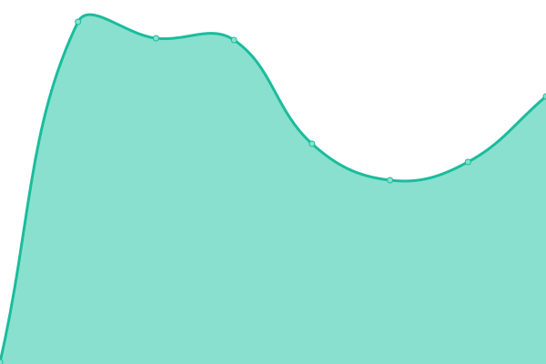

# [📈 Live Status](https://kodadot.github.io/uptime/): <!--live status--> **🟩 All systems operational**

This repository contains the open-source uptime monitor and status page for [Kodadot](https://kodadot.github.io/uptime/). We use [Issues](https://github.com/kodadot/uptime/issues) as incident reports, [Actions](https://github.com/kodadot/uptime/actions) as uptime monitors, and [Pages](https://kodadot.github.io/uptime/) for the status page.

<!--start: status pages-->
<!-- This summary is generated by Upptime (https://github.com/upptime/upptime) -->
<!-- Do not edit this manually, your changes will be overwritten -->
<!-- prettier-ignore -->
| URL | Status | History | Response Time | Uptime |
| --- | ------ | ------- | ------------- | ------ |
|  [durable-jpeg](https://durable-jpeg.kodadot.workers.dev/batch) | 🟩 Up | [durable-jpeg.yml](https://github.com/kodadot/uptime/commits/HEAD/history/durable-jpeg.yml) | 

 412ms
     
 | 

<a href="https://uptime.kodadot.xyz/history/durable-jpeg">100.00%</a>
    

|  [direct-upload](https://direct-upload.kodadot.workers.dev/) | 🟩 Up | [direct-upload.yml](https://github.com/kodadot/uptime/commits/HEAD/history/direct-upload.yml) | 

 84ms
     
 | 

<a href="https://uptime.kodadot.xyz/history/direct-upload">100.00%</a>
    

|  [estuary](https://pinning.kodadot.workers.dev/) | 🟩 Up | [estuary.yml](https://github.com/kodadot/uptime/commits/HEAD/history/estuary.yml) | 

 105ms
     
 | 

<a href="https://uptime.kodadot.xyz/history/estuary">100.00%</a>
    

|  [nft-storage](https://nft-storage.kodadot.workers.dev/) | 🟩 Up | [nft-storage.yml](https://github.com/kodadot/uptime/commits/HEAD/history/nft-storage.yml) | 

 103ms
     
 | 

<a href="https://uptime.kodadot.xyz/history/nft-storage">100.00%</a>
    

|  [bsx](https://squid.subsquid.io/snekk/graphql) | 🟩 Up | [bsx.yml](https://github.com/kodadot/uptime/commits/HEAD/history/bsx.yml) | 

 381ms
     
 | 

<a href="https://uptime.kodadot.xyz/history/bsx">99.41%</a>
    

|  [snekk](https://squid.subsquid.io/snekk/v/004/graphql) | 🟩 Up | [snekk.yml](https://github.com/kodadot/uptime/commits/HEAD/history/snekk.yml) | 

 455ms
     
 | 

<a href="https://uptime.kodadot.xyz/history/snekk">96.45%</a>
    

|  [movr](https://squid.subsquid.io/click/v/002/graphql) | 🟩 Up | [movr.yml](https://github.com/kodadot/uptime/commits/HEAD/history/movr.yml) | 

 456ms
     
 | 

<a href="https://uptime.kodadot.xyz/history/movr">97.01%</a>
    

|  [glmr](https://squid.subsquid.io/antick/v/001-rc0/graphql) | 🟩 Up | [glmr.yml](https://github.com/kodadot/uptime/commits/HEAD/history/glmr.yml) | 

 450ms
     
 | 

<a href="https://uptime.kodadot.xyz/history/glmr">97.43%</a>
    

|  [rmrk2](https://squid.subsquid.io/marck/graphql) | 🟩 Up | [rmrk2.yml](https://github.com/kodadot/uptime/commits/HEAD/history/rmrk2.yml) | 

 449ms
     
 | 

<a href="https://uptime.kodadot.xyz/history/rmrk2">96.58%</a>
    

|  [rmrk1](https://squid.subsquid.io/rubick/graphql) | 🟩 Up | [rmrk1.yml](https://github.com/kodadot/uptime/commits/HEAD/history/rmrk1.yml) | 

 453ms
     
 | 

<a href="https://uptime.kodadot.xyz/history/rmrk1">96.46%</a>
    

|  [stmn](https://squid.subsquid.io/stick/graphql) | 🟩 Up | [stmn.yml](https://github.com/kodadot/uptime/commits/HEAD/history/stmn.yml) | 

 155ms
     
 | 

<a href="https://uptime.kodadot.xyz/history/stmn">99.40%</a>
    

|  [stt](https://squid.subsquid.io/speck/v/v1/graphql) | 🟩 Up | [stt.yml](https://github.com/kodadot/uptime/commits/HEAD/history/stt.yml) | 

 657ms
     
 | 

<a href="https://uptime.kodadot.xyz/history/stt">96.25%</a>
    

|  [stmn - drops](https://squid.subsquid.io/stick/graphql) | 🟩 Up | [stmn-drops.yml](https://github.com/kodadot/uptime/commits/HEAD/history/stmn-drops.yml) | 

 568ms
     
 | 

<a href="https://uptime.kodadot.xyz/history/stmn-drops">99.40%</a>
    

|  [stt - drops](https://squid.subsquid.io/speck/v/v1/graphql) | 🟩 Up | [stt-drops.yml](https://github.com/kodadot/uptime/commits/HEAD/history/stt-drops.yml) | 

 1498ms
     
 | 

<a href="https://uptime.kodadot.xyz/history/stt-drops">96.25%</a>
    

|  [rubick - curated list](https://squid.subsquid.io/rubick/graphql) | 🟩 Up | [rubick-curated-list.yml](https://github.com/kodadot/uptime/commits/HEAD/history/rubick-curated-list.yml) | 

 502ms
     
 | 

<a href="https://uptime.kodadot.xyz/history/rubick-curated-list">96.46%</a>
    

|  [rubick - newest list](https://squid.subsquid.io/rubick/graphql) | 🟩 Up | [rubick-newest-list.yml](https://github.com/kodadot/uptime/commits/HEAD/history/rubick-newest-list.yml) | 

 1616ms
     
 | 

<a href="https://uptime.kodadot.xyz/history/rubick-newest-list">96.35%</a>
    

|  [rubick - latest sales](https://squid.subsquid.io/rubick/graphql) | 🟩 Up | [rubick-latest-sales.yml](https://github.com/kodadot/uptime/commits/HEAD/history/rubick-latest-sales.yml) | 

 810ms
     
 | 

<a href="https://uptime.kodadot.xyz/history/rubick-latest-sales">96.35%</a>
    

|  [rubick - spotlight](https://squid.subsquid.io/rubick/graphql) | 🟩 Up | [rubick-spotlight.yml](https://github.com/kodadot/uptime/commits/HEAD/history/rubick-spotlight.yml) | 

 424ms
     
 | 

<a href="https://uptime.kodadot.xyz/history/rubick-spotlight">96.35%</a>
    

|  [rubick - series-insight](https://squid.subsquid.io/rubick/graphql) | 🟩 Up | [rubick-series-insight.yml](https://github.com/kodadot/uptime/commits/HEAD/history/rubick-series-insight.yml) | 

 463ms
     
 | 

<a href="https://uptime.kodadot.xyz/history/rubick-series-insight">96.35%</a>
    

|  [rubick - sales](https://squid.subsquid.io/rubick/graphql) | 🟩 Up | [rubick-sales.yml](https://github.com/kodadot/uptime/commits/HEAD/history/rubick-sales.yml) | 

 243ms
     
 | 

<a href="https://uptime.kodadot.xyz/history/rubick-sales">96.35%</a>
    

|  [rubick - hot](https://squid.subsquid.io/rubick/graphql) | 🟩 Up | [rubick-hot.yml](https://github.com/kodadot/uptime/commits/HEAD/history/rubick-hot.yml) | 

 276ms
     
 | 

<a href="https://uptime.kodadot.xyz/history/rubick-hot">96.36%</a>
    

|  [Seo Card](https://og-image-green-seven.vercel.app/) | 🟩 Up | [seo-card.yml](https://github.com/kodadot/uptime/commits/HEAD/history/seo-card.yml) | 

 83ms
     
 | 

<a href="https://uptime.kodadot.xyz/history/seo-card">100.00%</a>
    

|  [Seo Card with Content](https://og-image-green-seven.vercel.app/%20Luna%20Witches%20%233.jpeg?price=0.5500KSM&image=https://image.w.kodadot.xyz/ipfs/bafybeifkgsyqa6h5mniydsz75yzd7qrffq5jh3osgjlafab2pnlsutsyvy&mime=image/jpeg) | 🟩 Up | [seo-card-with-content.yml](https://github.com/kodadot/uptime/commits/HEAD/history/seo-card-with-content.yml) | 

 2768ms
     
 | 

<a href="https://uptime.kodadot.xyz/history/seo-card-with-content">99.78%</a>
    

|  [KodaDot - production](https://kodadot.xyz/) | 🟩 Up | [koda-dot-production.yml](https://github.com/kodadot/uptime/commits/HEAD/history/koda-dot-production.yml) | 

 71ms
     
 | 

<a href="https://uptime.kodadot.xyz/history/koda-dot-production">100.00%</a>
    

|  [KodaDot - beta](https://beta.kodadot.xyz/) | 🟩 Up | [koda-dot-beta.yml](https://github.com/kodadot/uptime/commits/HEAD/history/koda-dot-beta.yml) | 

 109ms
     
 | 

<a href="https://uptime.kodadot.xyz/history/koda-dot-beta">100.00%</a>
    

|  [KodaDot - canary](https://canary.kodadot.xyz/) | 🟩 Up | [koda-dot-canary.yml](https://github.com/kodadot/uptime/commits/HEAD/history/koda-dot-canary.yml) | 

 158ms
     
 | 

<a href="https://uptime.kodadot.xyz/history/koda-dot-canary">100.00%</a>
    

<!--end: status pages-->

[**Visit our status website →**](https://kodadot.github.io/uptime/)

## 📄 License

- Powered by: [Upptime](https://github.com/upptime/upptime)
- Code: [MIT](./LICENSE) © [KodaDot](https://kodadot.github.io/uptime/)
- Data in the `./history` directory: [Open Database License](https://opendatacommons.org/licenses/odbl/1-0/)
